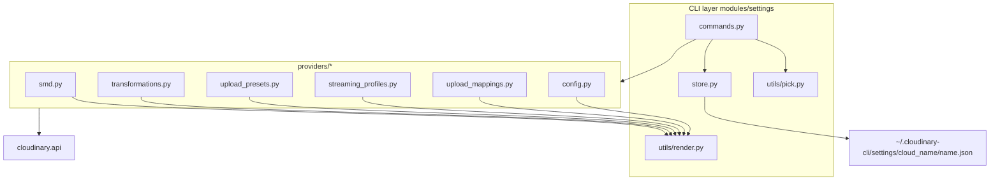
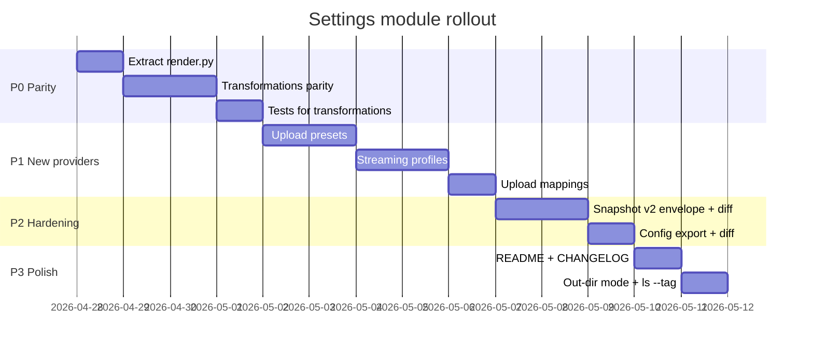

# Settings module — technical design

Status: Implemented (Apr 2026) — all six in-scope components landed on `feature/settings`
Owner: feature/settings
Scope: `cloudinary_cli/modules/settings`

> **See also:**
> - [`settings.md`](settings.md) — end-user guide for `cld settings`.
> - [`settings-implementation.md`](settings-implementation.md) —
>   maintainer-oriented implementation notes (decisions, divergences from
>   this design, known stubs/TODOs, runbook for adding a new provider).
> - [`settings-fix-plan.md`](settings-fix-plan.md) — phased remediation plan
>   for the issues found in review (v1/v2 collapse, bug fixes, refactors).
> - [`settings-redesign.md`](settings-redesign.md) — proposed new internal
>   architecture (engine + ResourceSpec) that supersedes this design's §3.
> - [`settings-test-plan.md`](settings-test-plan.md) — coverage matrix,
>   regression tests, and live integration harness.

## 1. Goal

Provide a single CLI surface to **save, restore, and clone Cloudinary product-environment configuration** ("settings") between accounts. Settings are configuration-style entities (templates, rules, presets, profiles), distinct from asset data (resources, folders) — the latter are owned by the existing `clone`, `migrate`, and `sync` modules.

The module must support multiple components behind one consistent UX, deterministic plans, and three apply modes.

## 2. Components in scope

| # | Component | Status | SDK methods | Identity key | Notes |
|---|---|---|---|---|---|
| 1 | SMD: metadata fields + metadata rules | Implemented | `list_metadata_fields`, `add/update/delete_metadata_field`, `update/restore/delete_metadata_field_datasource`, `list_metadata_rules`, `add/update/delete_metadata_rule` | `external_id` (field), `name` (rule) | Datasource entries need a dedicated sync path; rules block field/option deletes |
| 2 | Named transformations | Implemented | `transformations(named=True)`, `transformation`, `create/update/delete_transformation` | `name` (with `t_` prefix in responses) | Strip `t_` prefix on writes; `unsafe_update=True` on update |
| 3 | Upload presets | Implemented | `upload_presets`, `upload_preset`, `create/update/delete_upload_preset` | `name` | Server returns `external_id`; treat as noisy. `unsigned` is mutable |
| 4 | Streaming profiles | Implemented | `list_streaming_profiles`, `get/create/update/delete_streaming_profile` | `name` | See §6.4 for built-in vs custom semantics — exported as custom-only; built-ins are surfaced separately. Built-in defaults table is currently a placeholder; see [`settings-implementation.md` §5.1](settings-implementation.md) |
| 5 | Upload mappings | Implemented | `upload_mappings`, `upload_mapping`, `create/update/delete_upload_mapping` | `folder` | Update by `folder` + new `template` |
| 6 | Product environment config | Implemented (read/diff only) | `cloudinary.api.config(settings=True)` | n/a (singleton) | Always captured by save (including `cloud_name`); never auto-applied; `cld settings diff` reports drift; manual fixup in Console |

Deferred to a later release (see §13): webhook triggers (Admin API has no SDK helper and identity matching is composite — needs design buy-in before code), Provisioning-API account config writes (separate auth surface), SAML / users / groups, access control rules, eval add-ons.

Out of scope permanently: folders / resources (owned by `clone`, `migrate`, `sync`).

## 3. Architecture



Three sharp boundaries:

- **CLI layer** parses options, resolves source/target configs, picks snapshot files, and orchestrates providers.
- **Provider layer** implements one component each, behind a uniform contract.
- **Store layer** owns snapshot file paths and listing — no business logic.

### 3.1 Provider contract

Every provider exposes the following functions with consistent signatures:

```python
# cloudinary_cli/modules/settings/providers/<component>.py

COMPONENT = "<key>"           # e.g. "smd", "transformations", "upload_presets"
PICK_KINDS = ("name",)        # supported --pick kinds for this component
PICK_ALL_SENTINEL = "__ALL_<COMPONENT>__"


def export_bundle(*, picks=None, related=None) -> dict:
    """Read from current config and return a JSON-serializable bundle."""


def summarize_bundle(bundle) -> list[str]:
    """Return a flat list of identifiers for top-of-snapshot summary."""


def apply_bundle(
    bundle,
    *,
    target_options=None,   # config_to_dict for cloning, None for restore-to-self
    picks=None,
    related=None,
    mode="create-missing", # "create-missing" | "upsert" | "sync"
    dry_run=False,
    force=False,
) -> bool:
    """Plan + (optionally) confirm + apply. Returns True iff target reached desired state."""


def delete_items(
    *,
    target_options=None,
    picks=None,
    related=None,
    dry_run=False,
    force=False,
) -> bool:
    """Selective delete. Required only for components that support `settings <c> delete`."""
```

The shared `utils/render.py` provides `c()` (color), `format_items`, `format_section`, `colorize_diff_line`, `format_updates_with_diffs`, `diff_any`, `compact` — extracted from today's `providers/smd.py` so every provider produces identical-looking plans and confirms.

### 3.2 Apply mode semantics (uniform across providers)

| Mode | Create missing | Update differing | Delete extras |
|---|---|---|---|
| `create-missing` (default) | yes | no | no |
| `upsert` | yes | yes | no |
| `sync` | yes | yes | yes |

"Extras" = items present in the target whose identity is **not** in the desired selection (not in the snapshot AND not filtered out by `--pick`). Selection narrows the universe; mode decides what happens within it.

### 3.3 Selection model (`--pick`)

`--pick <group> <kind> <value>` (repeatable). Groups equal component keys. Kinds and sentinels per component:

- `smd`: `field <external_id|*>`, `rule <name|*>`
- `transformations`: `name <name|*>`
- `upload_presets`: `name <name|*>`
- `streaming_profiles`: `name <name|*>`
- `upload_mappings`: `folder <folder|*>`
- `config`: not pickable (singleton); always captured at save, never applied at restore

Wildcards (`*`, `?`, `[abc]`) use `fnmatch`; the existing `_expand_names_with_patterns` helper in `smd.py` is reused.

### 3.4 Dependency ordering at apply

Cross-component ordering matters because Cloudinary enforces references:

1. `upload_mappings` (no deps)
2. `streaming_profiles` (no deps)
3. `transformations` (referenced by upload presets via `eager` / `transformation`)
4. `smd.fields`
5. `smd.rules` (reference fields)
6. `upload_presets` (may reference transformations, metadata fields, streaming profiles)
7. `config` — never auto-applied; only diffed and reported

Delete order is the reverse, additionally with within-component ordering already implemented in SMD (rules before fields, options that aren't blocked by rules).

## 4. Snapshot file schema

Single JSON file. Schema is **additive**; missing component sections simply mean "not captured". Bumped to `schema_version: 2` to signal multi-component support and the new envelope fields below — older v1 (smd-only) files load unchanged (the loader treats missing envelope fields as `None`).

The envelope borrows three ideas from Terraform state files (see [State internals](https://developer.hashicorp.com/terraform/language/state)) — `lineage`, `serial`, and a recorded writer version — because they pay for themselves the moment we add cloud-backed storage (§13). The `metadata` block borrows from gcloud Config Connector's annotation pattern.

```jsonc
{
  "schema_version": 2,
  "type": "settings_snapshot",

  // Identity / provenance
  "name": "demo_all_2026-04-27_13-52-12-345",
  "lineage": "5fc28b2e-bf0c-4a9d-9b5d-1d6e9d83c0a4", // UUID; stable across copies/renames
  "serial": 1,                                       // bumps each save under the same lineage
  "created_at": "2026-04-27T10:52:12.345+00:00",
  "writer": {
    "cli_version": "1.13.1",
    "sdk_version": "1.39.0",
    "user": "alice@host"   // best-effort: $USER@$HOSTNAME, never identity beyond this
  },

  // Source / selection at save time
  "source": { "cloud_name": "demo", "config_settings": { "folder_mode": "dynamic" } },
  "components": ["smd","transformations","upload_presets","streaming_profiles","upload_mappings","config"],
  "selection": { "components": [...], "picks": [["smd","field","content_*"]] },
  "metadata": { "notes": "pre-Q3-launch backup", "tags": ["pre-launch","verified"] },

  // Integrity
  "fingerprints": {
    "smd":                "sha256:...",
    "transformations":    "sha256:...",
    "upload_presets":     "sha256:...",
    "streaming_profiles": "sha256:...",
    "upload_mappings":    "sha256:...",
    "config":             "sha256:..."
  },
  "checksum": "sha256:...", // over canonical JSON of components + sections; envelope excluded

  // Component bundles (any may be absent)
  "smd":                { "fields": [...], "rules": [...] },
  "transformations":    { "transformations": [...] },
  "upload_presets":     { "presets": [...] },
  "streaming_profiles": { "custom_profiles": [...], "overridden_builtins": [...] },
  "upload_mappings":    { "mappings": [...] },
  "config":             { "settings": {...}, "applicable": false }
}
```

Stored at `~/.cloudinary-cli/settings/<cloud_name>/<name>.json`, JSON pretty-printed (`indent=2`) for diff-friendliness.

Field rationale, terse:

- `lineage` lets users copy `demo/snap.json → prod/snap.json` and still see "this came from demo" — and makes future cloud-backed storage (§13) safe by preventing two unrelated streams clobbering each other.
- `serial` makes "is this the same snapshot or an older copy?" answerable without diffing the body.
- `writer.cli_version` / `writer.sdk_version` make "this snapshot was made before we changed normalization rules" debuggable.
- `selection` records the exact `--component` / `--pick` flags used at save so a user can reproduce the same export with one command.
- `metadata.notes` and `metadata.tags` are surfaced by `cld settings ls` and filterable via `cld settings ls --tag pre-launch` (planned in P3).
- `checksum` and per-component `fingerprints` make tampering obvious and let the future cloud backend short-circuit `pull` when the local copy is already current.

### 4.1 Optional directory mode (planned)

For users who want git-friendly per-component diffs (gcloud Config Connector style), `--out-dir <path>` writes:

```text
<dir>/_index.json     # envelope only (no component bundles)
<dir>/smd.json
<dir>/transformations.json
<dir>/upload_presets.json
...
```

`cld settings restore --in-dir <path>` reverses the operation. Single-file mode remains the default.

## 5. CLI surface

Existing top-level group preserved: `cld settings`. Subcommands:

- `cld settings save [NAME] [--component ...] [--pick ...] [--out PATH | --out-dir DIR] [--note "..."] [--tag x --tag y] [-F]`
- `cld settings ls [--cloud CLOUD] [--json] [--tag x]`
- `cld settings show NAME [--cloud CLOUD] [--out PATH]`
- `cld settings rm NAME [--cloud CLOUD] [-F]`
- `cld settings diff [NAME] [--in PATH] [--cloud CLOUD] [--component ...] [--pick ...]`  &nbsp;# new — promote drift view to first-class
- `cld settings restore [NAME] [--in PATH] [--cloud CLOUD] [--component ...] [--pick ...] [--mode ...] [--dry-run] [-F]`
- `cld settings clone TARGET [TARGET ...] [--from NAME | --in PATH] [--component ...] [--pick ...] [--mode ...] [--dry-run] [-F]`
- `cld settings folder [--open]`

Per-component admin subgroups (only `delete` initially; selective list/show optional later):

- `cld settings smd delete [--pick ...] [--smd-include-rules] [--dry-run] [-F]`
- `cld settings transformations delete [NAMES...|--pick ...] [--dry-run] [-F]`
- `cld settings upload-presets delete ...`
- `cld settings streaming-profiles delete ...` (refuses `predefined: true` unless `--allow-revert-builtins`; see §6.4)
- `cld settings upload-mappings delete ...`
- `cld settings config diff [--in PATH]` (no apply; reports drift only — alias of `cld settings diff --component config`)

`config` is always captured by `save` (including `cloud_name` and `settings.folder_mode`); `restore` and `clone` always skip it with a warning. The only restore-time interaction is the read-only `diff`.

## 6. Per-component design notes

### 6.1 SMD (already implemented — keep as reference)

- Identity: `external_id` for fields, `name` for rules.
- Diff normalization in `_normalize_field_for_compare` strips `created_at`, `updated_at`, `lazy_datasource_update`; sorts datasource values; ignores target-only `inactive` entries.
- Datasource sync handled via dedicated `update_metadata_field_datasource` + `delete_datasource_entries` + `restore_metadata_field_datasource` (see `_sync_field_datasource`), with rule-aware blocking for option deactivation/deletion.
- Apply order: delete rules → delete fields → create/update fields (+ datasource sync) → create/update rules.

### 6.2 Transformations (in progress — bring to parity)

Current gaps vs SMD:

- Plan output: `logger.info` lines + plain confirm; lift to colorized `_format_section` + per-item debug diffs using shared `render.py`.
- Normalization: only chain + `allowed_for_strict`; expand to drop `used`, `info` aliasing, name-prefix mismatch (`t_*`).
- Mode validation: missing; mirror `apply_smd_bundle` lower-case + raise.
- Errors: `_create_transformation` swallows `409` for any error containing the substring; tighten to status-code check; surface immutable-name errors clearly on update.
- `delete_transformations` mirrors `delete_smd_items` — show missing/skipped names.

Identity: stored with `t_` prefix from list/get; calls require unprefixed name (`_strip_named_prefix`).

### 6.3 Upload presets

Sample response:

```json
{
  "name": "remote_media",
  "unsigned": false,
  "settings": { "tags": "test", "allowed_formats": "jpg,png", "eager": "c_fill,g_face,h_150,w_200" },
  "external_id": "3206588g-..."
}
```

- Identity: `name`. `external_id` is server-assigned — strip during normalization.
- Export: `cloudinary.api.upload_presets(max_results=...)` for list; `cloudinary.api.upload_preset(name)` for full settings (the list endpoint already includes `settings`, but pagination still applies — use existing `call_api_with_pagination`).
- Create: `cloudinary.api.create_upload_preset(name=..., unsigned=..., **settings)`.
- Update: `cloudinary.api.update_upload_preset(name, **settings)`.
- Delete: `cloudinary.api.delete_upload_preset(name)`.
- Normalization: drop `external_id`, `created_at`, `updated_at`. Sort `tags` if list-typed before compare.
- References: `transformation`, `eager`, `metadata` keys may reference other settings — these are strings/expressions and don't need symbolic resolution; copy as-is.

### 6.4 Streaming profiles

The Admin API exposes two flavors of profile: **custom** (`predefined: false`, fully owned by the customer) and **built-in** (`predefined: true`, e.g. `4k`, `full_hd`, `hd`, `sd`, `4k_wifi`, ...). The same endpoints work on both — but with very different semantics on UPDATE and DELETE:

- `PUT /streaming_profiles/<name>` on a built-in **overrides** the default representations for that profile in this product environment.
- `DELETE /streaming_profiles/<name>` on a custom profile **removes** it; on an overridden built-in it **reverts** the override (the name itself can never be removed).

This makes "delete" lossy and surprising on built-ins. Our chosen semantics:

- **Save** exports two lists for diff/restore symmetry:
  - `streaming_profiles.custom_profiles` — all `predefined: false` profiles, full body.
  - `streaming_profiles.overridden_builtins` — `predefined: true` profiles whose `representations` differ from Cloudinary's published defaults (we ship a tiny built-in defaults table; if a profile's `representations` don't match, we treat it as overridden). Empty in the common case.
- **Apply** (`create-missing` / `upsert` / `sync`):
  - For `custom_profiles`: standard create / update / delete by `name`.
  - For `overridden_builtins`: only `update_streaming_profile` is ever issued (re-applying the captured override). We never create them (they pre-exist) and never delete them in `sync` — `sync` deleting a built-in would silently revert it on the target, which violates "principle of least surprise".
- **Standalone delete** (`cld settings streaming-profiles delete <name>`):
  - Custom profile → DELETE removes it. Standard.
  - Built-in profile → refused by default with a friendly error: `"sd" is a built-in profile. DELETE will revert any local overrides. Re-run with --allow-revert-builtins to proceed.`
  - With `--allow-revert-builtins`, the operation runs and the plan output classifies the row as `revert built-in` rather than `delete` so the user sees what they signed up for.

### Why this matters

Two real failure modes we want to prevent:

1. A user clones from `demo` → `prod` in `sync` mode. Their `prod` had a custom `hd` override (e.g., extra 1080p rung). Source `demo` doesn't override `hd`. Naive sync would DELETE `hd` on `prod` → that reverts `prod`'s override → silent regression in delivery quality. Our rule (never delete built-ins in sync) prevents this.
2. A user mistypes `cld settings streaming-profiles delete sd` (instead of `cld_sd`). Without the guard, this would silently revert their carefully tuned override of the built-in `sd`. The default refusal turns a 30-second outage into a re-run.

### Build-in defaults table

Maintained as a Python constant (`BUILTIN_STREAMING_PROFILE_DEFAULTS`) seeded from the [docs page](https://cloudinary.com/documentation/video_manipulation_and_delivery#predefined_streaming_profiles). Refreshed via a small unit test that compares against a fresh fetch on a virgin product environment (run manually when Cloudinary updates the defaults).

### 6.5 Upload mappings

- Identity: `folder`.
- Export: `cloudinary.api.upload_mappings(max_results=...)` (paginated).
- Create: `create_upload_mapping(folder, template=...)`.
- Update: `update_upload_mapping(folder, template=...)`.
- Delete: `delete_upload_mapping(folder)`.
- Normalization: drop `external_id`, timestamps.

### 6.6 Product environment config

`cloudinary.api.config(settings=True)` returns a small read-only object: `cloud_name`, `created_at`, and `settings.folder_mode`. The Admin API has **no** mutating endpoint for these fields — only the Provisioning API can update some of them, and Provisioning auth (account URL) is a separate surface.

v1 behavior:

- **Save always captures** `config(settings=True)` and stores it under `config.settings`, including read-only fields like `cloud_name`. These are valuable forensics: at restore time you know which cloud the snapshot came from, and `folder_mode` (`fixed` vs `dynamic`) is a real product-environment setting that affects whether other components even apply the same way.
- `applicable: false` is set on the bundle so any future writer knows not to attempt PUTs.
- **Restore / clone always skip** the `config` component with `logger.warning("Config is captured for diffing only and is never applied. Use `cld settings diff --component config` to see drift; change values in the Console or via the Provisioning API.")`.
- `cld settings diff --component config` (and its alias `cld settings config diff`) is the only restore-time interaction — pure read.
- The recorded `cloud_name` is also surfaced in `cld settings show` and `cld settings ls --json` so a user grepping for "which snapshot came from prod-eu?" gets an answer without parsing the filename.

Future (out of scope for v1): Provisioning-API write path behind a separate `--account-config` flag with its own auth (see §13).

## 7. Error and partial-success model

- Each provider returns `bool` for overall success; component failures don't abort other components in `restore`/`clone`.
- Per-component failures are aggregated; the CLI exit code is non-zero if any component failed (mirrors today's `clone_settings`).
- Known recoverable errors are caught with actionable messages (existing SMD example: rule blocks field option deletion → suggest `--smd-include-rules`).
- Network/HTTP errors propagate via the SDK's existing exception types (`cloudinary.api.RateLimited` etc.).

## 8. Concurrency

Read-side: `call_api_with_pagination` is sequential per resource type, but providers may parallel-fetch details (transformations does this with `ThreadPool(30)`). Apply-side: parallelism stays per-section to preserve human-readable ordered logs and avoid masking failures. Default workers = 30 (matches existing `transformations.py`); make it tunable via `CLOUDINARY_CLI_SETTINGS_WORKERS` env var if needed later.

## 9. Testing strategy

For each provider:

- **Unit tests** (mock `call_api_with_pagination` and per-resource SDK calls):
  - `export` filters by exact name and wildcard; honors `__ALL_*__` sentinel.
  - `apply` plans correctly for all 3 modes; create-missing skips detail fetch where supported; sync deletes extras; upsert updates only differing items.
  - `delete` honors wildcards, dry-run, and reports missing items.
  - Normalization: timestamps and server-only fields don't trigger updates.
- **CLI integration tests** with `CliRunner.isolated_filesystem`:
  - `--out` produces pretty JSON; `--in` round-trips.
  - `--pick` parsing for the new groups (parallels existing `test_parse_picks_all_sentinels`).
- **Live integration tests** (gated on real credentials, prefixed identifiers, cleanup in `tearDown`) for at least one happy-path roundtrip per provider.

## 10. Phased rollout



Phase gates:

- **P0** ships when SMD and transformations both produce identical-looking plans and tests pass.
- **P1** ships when each new provider has unit tests, lives behind shared `render.py`, and is wired into `save`/`restore`/`clone`/`<c> delete`.
- **P2** ships when snapshots use schema v2 envelope (lineage, serial, fingerprints, checksum), `cld settings diff` is first-class, and `cld settings config diff` exits non-zero on drift.
- **P3** ships when README documents the workflow, CHANGELOG has a "Settings management" entry, and directory mode (`--out-dir`) plus tag filtering (`ls --tag`) are wired in.

Triggers, Provisioning-API config writes, and cloud-backed snapshot storage are tracked in §13 (future) — not part of this rollout.

## 11. Best practices borrowed from prior art

We surveyed three CLIs that solve adjacent problems and pulled in the patterns that pay off for our use case.

### From Terraform state (HashiCorp)

- **Schema versioning + auto-upgrade on read** — already adopted (`schema_version: 2`, v1 reads supported).
- **`lineage` UUID + `serial` integer** — adopted (§4). Cheap to add now; essential the moment we add cloud-backed storage (§13). Lineage prevents two unrelated streams from colliding; serial answers "is this the same snapshot as before, just pulled?" without diffing the body.
- **Recorded writer version** (`writer.cli_version`, `writer.sdk_version`) — adopted. When a snapshot fails to apply on a newer CLI, the diff between writer versions is the first clue.
- **"Don't edit the JSON by hand"** — adopted as a documentation rule. The CLI is the supported edit path.

### From kubectl

- **`diff` as a first-class verb** — adopted. Promote drift visibility from a `--debug` side-effect to `cld settings diff`. This is the same affordance as `kubectl diff` and matches the mental model users already have.
- **`--dry-run`** — already in scope; documented in §3.2.
- **Field-ownership / server-side apply** — *not* adopted. Cloudinary has no server-side apply primitive, and our normalization layer does the equivalent work client-side.

### From gcloud Config Connector

- **Per-resource YAML/JSON files, with an index** — adopted as optional `--out-dir` (§4.1). Single-file remains the default for one-shot save/restore; directory mode is for users who want git-tracked, per-component diffs.
- **`print-resources` to enumerate supported types** — adopted as `cld settings components` (a tiny new subcommand listing component keys, identity fields, and SDK status — handy for users and for our own integration tests).

### From AWS CLI / AWS Config

- **"Delivery channel" abstraction** (where snapshots go) — partially adopted. Today: local FS only. Tomorrow: cloud-backed (§13). The single point of indirection is the `Store` layer in `store.py`; `LocalStore` becomes one of two implementations.

### What we are NOT borrowing

- **Bucket-level locking (Terraform DynamoDB / GCS lock files).** A settings snapshot has no `apply` race surface across CLIs the way Terraform state does — at most a user clobbers their own JSON. Out of scope.
- **Encryption at rest by default** (Terraform/GCS recommendation). Snapshot bodies do not contain credentials. Cloud-backed storage (§13) will default to `type=authenticated` raw assets, which gates download on signed URLs — that's the equivalent boundary.

### Snapshot file additions adopted from this review

Already folded into §4 (the schema): `lineage`, `serial`, `writer.{cli_version,sdk_version,user}`, `selection`, `metadata.{notes,tags}`, `fingerprints`, `checksum`. Plus the `--out-dir` directory mode (§4.1) and the new `cld settings diff` verb.

## 12. Decisions

- **One snapshot file per save, not one per component.** Single-file is the default; `--out-dir` adds a per-component layout for git workflows.
- **Per-component confirmation prompts, not a unified one.** Lets a user accept SMD changes while declining transformations.
- **No symbolic cross-component link rewriting.** A snapshot exported from cloud A and applied to cloud B keeps strings (e.g., `eager: "t_thumbnail"`) verbatim. If `t_thumbnail` doesn't exist in B, the upload preset still applies but Cloudinary surfaces a runtime error on use. Documented in README.
- **`config` is captured by every save** (including `cloud_name`, `created_at`, `settings.folder_mode`) but **never auto-applied** at restore — only diffed.
- **Streaming profiles delete refuses built-ins** by default. `--allow-revert-builtins` is the explicit opt-in. `sync` mode never deletes built-ins. See §6.4 for the failure-mode rationale.
- **Webhook triggers are deferred** to a future release (see §13). The Admin API endpoint exists but has no SDK wrapper, identity matching is composite, and we want at least one full release of the simpler providers in users' hands before adding it.

## 13. Future features

A staging area for things deliberately out of v1, with enough sketch to make sure the v1 design doesn't paint us into a corner.

### 13.1 Cloud-backed snapshot storage

Today, snapshots live at `~/.cloudinary-cli/settings/<cloud_name>/<name>.json` — fine for one user on one machine, awkward across a team. Cloudinary already gives us versioned authenticated raw asset storage, so the natural backend is Cloudinary itself.

```mermaid
sequenceDiagram
  participant U as User
  participant CLI as cld settings
  participant Store as Store layer
  participant CC as Cloudinary
  U->>CLI: cld settings push prod_2026_q3
  CLI->>Store: read local snapshot
  Store->>CC: upload(resource_type=raw,<br/>type=authenticated,<br/>asset_folder=cld-cli-settings/,<br/>public_id=<name>,<br/>tags=[cld-cli-settings, lineage:&lt;uuid&gt;],<br/>context={lineage,serial,checksum})
  CC-->>Store: version, public_id
  Store-->>CLI: ok
  U->>CLI: cld settings pull prod_2026_q3
  CLI->>CC: search by public_id (signed)
  CC-->>CLI: signed URL
  CLI->>Store: download + verify checksum
```

Proposed shape:

- New verbs: `cld settings push <name>`, `cld settings pull <name>`, `cld settings ls --remote`, `cld settings rm <name> --remote`.
- Storage: `resource_type=raw`, `type=authenticated`, `asset_folder=cld-cli-settings/`, `public_id=<name>`, `tags=["cld-cli-settings", f"lineage:{lineage}"]`, structured `context` carrying `lineage`, `serial`, `checksum`, `cli_version`.
- Versioning: Cloudinary already versions assets on overwrite. `pull` can pin via `--version <id>` if needed; default is latest.
- Conflict detection: before overwrite, `push` reads remote `context.serial` and refuses if remote serial > local (rebase-required). `--force` overrides. This is the lightweight equivalent of Terraform state locking.
- Auth: piggy-backs on the existing CLOUDINARY_URL — no new credentials.
- Optional encryption (P+1): client-side encrypt body before upload (e.g., age/sodium) keyed off a passphrase or a KMS reference. Stored ciphertext is opaque to Cloudinary. Off by default; users who want it can opt in with `push --encrypt`.

This is why §4's envelope already carries `lineage`, `serial`, `checksum`, and `fingerprints` — wiring these now means the cloud backend is a pure additive change, no schema bump.

### 13.2 Webhook triggers

Deferred from v1 (see §6 / §12). When implemented:

- Provider in `providers/triggers.py` using `cloudinary.api.call_json_api("GET"|"POST"|"PUT"|"DELETE", ["triggers", ...])`.
- Identity: composite `(event_type, uri)`. Server `id` is non-portable across product environments.
- Update semantics: only `uri` is updatable (`new_uri`); changing `event_type` is delete+create.
- `--pick triggers event <event_type>` and `--pick triggers uri <uri-pattern>` AND-combine when both kinds appear; OR-combine across separate `--pick`s of the same kind.

### 13.3 Provisioning-API config writes

`config` is read-only via Admin API. Provisioning API can update some fields (e.g., the resources/folder mode in some account tiers). Future shape:

- New flag: `cld settings restore --account-config` (explicit; never default).
- Requires `CLOUDINARY_ACCOUNT_URL`; CLI errors clearly when only `CLOUDINARY_URL` is present.
- Diff is the same as today's `cld settings diff --component config`; only the apply path is new.

### 13.4 Other deferred ideas

- **`cld settings ls --tag <tag>`** filtering on `metadata.tags` (cheap; planned for P3 polish).
- **`cld settings components`** subcommand — equivalent of gcloud's `print-resources`. Lists supported components, identity keys, SDK status. Useful for users and for self-test.
- **Snapshot signing**: detached signature alongside the file (gpg or sigstore). Combined with `--remote` storage gives per-team verification. Off by default.
- **Read-side caching**: if a `pull` finds the same `lineage:serial` already on disk, skip download. Pure optimization.

## 14. References

- Admin API reference: <https://cloudinary.com/documentation/admin_api>
- Upload presets: <https://cloudinary.com/documentation/upload_presets>
- Adaptive bitrate streaming + predefined streaming profiles: <https://cloudinary.com/documentation/adaptive_bitrate_streaming>
- Webhook notifications (deferred component): <https://cloudinary.com/documentation/notifications>
- Upload parameters (raw / authenticated, used in §13.1): <https://cloudinary.com/documentation/upload_parameters>
- Terraform state internals (envelope inspiration): <https://developer.hashicorp.com/terraform/language/state>
- kubectl diff (drift verb inspiration): <https://kubernetes.io/docs/reference/generated/kubectl/kubectl-commands#diff>
- gcloud Config Connector export (directory mode inspiration): <https://cloud.google.com/config-connector/docs/how-to/import-export/export>
- Existing modules to read for patterns: [`cloudinary_cli/modules/clone.py`](../cloudinary_cli/modules/clone.py), [`cloudinary_cli/utils/api_utils.py`](../cloudinary_cli/utils/api_utils.py)
