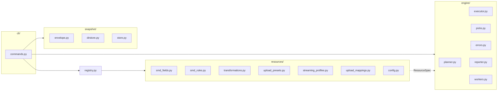

# `cld settings` — Architectural redesign

A proposed new internal architecture for `cloudinary_cli/modules/settings/`.
The public CLI surface (commands, flags, help text, exit codes, snapshot
envelope shape) is the contract; everything below it is replaceable.

> **See also:**
> - [`settings.md`](settings.md) — end-user guide (unchanged by this redesign).
> - [`settings-design.md`](settings-design.md) — current technical design.
> - [`settings-implementation.md`](settings-implementation.md) — current
>   maintainer notes.
> - [`settings-fix-plan.md`](settings-fix-plan.md) — phased migration plan.
>   Phase 2 of that plan is the incremental path to the architecture below.
> - [`settings-test-plan.md`](settings-test-plan.md) — what gets tested.

Status: proposed.
Owner: feature/settings.
Scope: `cloudinary_cli/modules/settings/`.

---

## 1. Why redesign

The settings module shipped in one large feature branch and the seams show.

### 1.1 Volume

`wc -l cloudinary_cli/modules/settings/**/*.py` = **6,482 LoC across 18 files**.

| File | LoC |
|---|---|
| [`providers/smd.py`](../cloudinary_cli/modules/settings/providers/smd.py) | 1,213 |
| [`commands.py`](../cloudinary_cli/modules/settings/commands.py) | 996 |
| [`providers/streaming_profiles.py`](../cloudinary_cli/modules/settings/providers/streaming_profiles.py) | 645 |
| [`providers/transformations.py`](../cloudinary_cli/modules/settings/providers/transformations.py) | 600 |
| [`providers/upload_presets.py`](../cloudinary_cli/modules/settings/providers/upload_presets.py) | 437 |
| [`providers/upload_mappings.py`](../cloudinary_cli/modules/settings/providers/upload_mappings.py) | 358 |
| [`utils/render.py`](../cloudinary_cli/modules/settings/utils/render.py) | 231 |
| [`utils/envelope.py`](../cloudinary_cli/modules/settings/utils/envelope.py) | 206 |
| [`utils/pick.py`](../cloudinary_cli/modules/settings/utils/pick.py) | 179 |
| [`providers/config.py`](../cloudinary_cli/modules/settings/providers/config.py) | 163 |
| [`providers/smd_table.py`](../cloudinary_cli/modules/settings/providers/smd_table.py) | 95 |
| [`providers/__init__.py`](../cloudinary_cli/modules/settings/providers/__init__.py) | 79 |
| [`store.py`](../cloudinary_cli/modules/settings/store.py) | 77 |
| [`utils/normalize.py`](../cloudinary_cli/modules/settings/utils/normalize.py) | 66 |
| [`utils/dirstore.py`](../cloudinary_cli/modules/settings/utils/dirstore.py) | 55 |

A 600-LoC provider for "named transformations" (an entity with one identity
key, no nested resources, and CRUD behind four SDK methods) is a smell.

### 1.2 Copy-paste

Each non-SMD provider implements the same five-step pipeline:

```
list_target -> filter_by_picks -> compute_buckets(create/update/delete)
            -> show_plan -> ThreadPool.map(create/update/delete)
```

The implementations are textually different but structurally identical. The
duplication shows up as:

- `_apply_changes(to_create, to_update, to_delete, target_options, mode, concurrent_workers)`
  defined four times
  ([transformations.py:390](../cloudinary_cli/modules/settings/providers/transformations.py),
  [upload_presets.py:259](../cloudinary_cli/modules/settings/providers/upload_presets.py),
  [upload_mappings.py:183](../cloudinary_cli/modules/settings/providers/upload_mappings.py),
  [streaming_profiles.py:401](../cloudinary_cli/modules/settings/providers/streaming_profiles.py)).
  Every copy:
  - defines `_create`/`_update`/`_delete` closures;
  - swallows `_is_already_exists(e)` on `create-missing`;
  - logs `"<Resource>: created '<id>'."` etc.;
  - rolls a `ThreadPool` with the same `max(1, min(concurrent_workers, max(...)))`
    incantation;
  - returns `all(results) if results else True`.
- `_is_already_exists` defined four times verbatim (same six lines).
- `_filter_list(items, picks)` reimplemented per provider.
- `DEFAULT_WORKERS = 30` declared four times.
- `_normalize_for_compare(...)` reimplemented per provider — the only place
  the differences are real, but the differences are 4 to 12 lines each, not
  60.
- Per-resource log prefixes (`"Upload presets: created..."`) hand-typed in
  every method, ~30 sites.
- `_is_overridden_builtin` lives only in streaming_profiles, but its general
  shape ("compare to a baseline") wants a contract, not a one-off.
- Diff plan rendering reinvented per provider (each plant prints its own
  "create / update / delete" sections).
- SMD has its own private `_format_section` / `_diff_any` / `_compact` /
  `_debug_log_diff` ([smd.py](../cloudinary_cli/modules/settings/providers/smd.py)
  lines 223, 694, 762, 676) that duplicate
  [`utils/render.py`](../cloudinary_cli/modules/settings/utils/render.py)
  helpers, plus its own `_index_by` and `_strip_dict_keys_deep` that duplicate
  [`utils/normalize.py`](../cloudinary_cli/modules/settings/utils/normalize.py).

### 1.3 Hardcoded values

- `BUILTIN_STREAMING_PROFILE_DEFAULTS` is a placeholder
  ([streaming_profiles.py:64–86](../cloudinary_cli/modules/settings/providers/streaming_profiles.py)),
  acknowledged as such in the implementation doc, and demonstrably wrong (every
  entry is `[{"transformation": "sp_auto"}]`).
- `DEFAULT_WORKERS = 30` four times.
- The `__ALL__` legacy sentinel still in 12 places after the per-component
  sentinels were added.
- Per-resource log prefixes baked into f-strings.

### 1.4 Dispatch pattern in `commands.py`

[`_apply_to_target`](../cloudinary_cli/modules/settings/commands.py) at line 899
hand-rolls per-component dispatch in an if/elif ladder for `smd`,
`transformations`, `upload_presets`, `streaming_profiles`, `upload_mappings`.
The whole point of the uniform `provider.apply_bundle(...)` contract was to
make this one call. `_run_diff` already does it correctly; the rest doesn't.

### 1.5 Test surface

SMD has live integration tests. The four newer providers don't. The unit
tests for the new providers patch `cloudinary.api.*` directly, which is fine
for happy paths but fragile for error classification (the four
`_is_already_exists` copies are tested separately).

### 1.6 Dead helpers

- `format_plan_header` ([utils/render.py:207](../cloudinary_cli/modules/settings/utils/render.py))
  defined and never called.
- `index_by` imported in three providers, called in zero.
- `SUPPORTED_COMPONENTS` alias in `commands.py` line 79 with no external
  consumer.
- `Picks.__iter__` / `__getitem__` exist solely for one test.

---

## 2. Goals and non-goals

### 2.1 Goals

- One engine that drives plan / apply / diff / delete for every resource. No
  per-resource if/elif anywhere in `commands.py` or in the engine.
- Each resource expressed as a small declarative `ResourceSpec` plus its
  resource-specific normalization. Adding a new resource means a single new
  file and one registry entry.
- All hardcoded API specifics live inside the resource specs (which are bound
  to `cloudinary.api.*` callables exactly once per spec).
- Engine and resource specs are unit-testable without `cloudinary.api.*`
  reachability — every SDK call point is a callable that mocks cleanly.
- Concurrency, error classification, log prefixes, plan rendering, and pick
  filtering are written once.
- Snapshot envelope is straightforward `schema_version: 1` (see
  [`settings-fix-plan.md`](settings-fix-plan.md) Phase 0).
- `cld settings --help` is unchanged.

### 2.2 Non-goals

- Changing the user-facing CLI: command names, flags, output format, exit
  codes are stable.
- Snapshot file format on disk (envelope fields, names) doesn't change beyond
  the v1 collapse.
- Adding new components beyond the six already in scope.
- Cloud-backed snapshot storage. If that ever becomes real, `lineage`/`serial`
  return; for now the redesign drops them (see §6).

---

## 3. Target architecture



### 3.1 Module layout

```
cloudinary_cli/modules/settings/
├── __init__.py
├── cli/
│   ├── __init__.py
│   └── commands.py           Click handlers; thin. Per-resource delete
│                             subcommands generated from the registry.
├── engine/
│   ├── __init__.py
│   ├── planner.py            Plan computation. diff(source, target, picks).
│   ├── executor.py           ThreadPool execution of a Plan.
│   ├── picks.py              Pick filter applied uniformly via patterns.
│   ├── errors.py             classify(exc) -> Outcome enum.
│   ├── reporter.py           Plan -> human/JSON output.
│   └── workers.py            default_workers(); CLOUDINARY_CLI_SETTINGS_WORKERS.
├── resources/
│   ├── __init__.py           ALL_RESOURCES, APPLY_ORDER (computed from deps).
│   ├── _base.py              ResourceSpec dataclass; ResourceOps protocol.
│   ├── smd_fields.py         SMD fields ResourceSpec.
│   ├── smd_rules.py          SMD rules ResourceSpec; depends on smd_fields.
│   ├── transformations.py    Transformations ResourceSpec.
│   ├── upload_presets.py     Upload presets ResourceSpec; depends on
│   │                          transformations (preset.transformation).
│   ├── streaming_profiles.py Streaming profiles ResourceSpec; built-ins
│   │                          handled via spec flags.
│   ├── upload_mappings.py    Upload mappings ResourceSpec.
│   └── config.py             Config: read-only ResourceSpec.
├── snapshot/
│   ├── __init__.py
│   ├── envelope.py           v1 envelope (no upgrade branch). fingerprints,
│   │                          checksum.
│   ├── dirstore.py           Directory layout. Prunes stale files.
│   └── store.py              Local CLI-managed snapshot store.
└── registry.py               Registers ResourceSpecs. One entry per resource.
```

Net effect:

- `providers/` deleted.
- `commands.py` shrinks to ~250 LoC of Click glue; per-resource dispatch is
  gone.
- `smd.py` deflates from 1,213 LoC to ~250 LoC of resource-specific
  normalization (datasource sync stays, but rendering and indexing helpers
  collapse onto shared utils).
- The four non-SMD provider files become ~80–150 LoC ResourceSpec files each.
- ~6,500 LoC -> projected ~2,800–3,200 LoC.

### 3.2 `ResourceSpec` contract

```python
# resources/_base.py

@dataclass(frozen=True, slots=True)
class ResourceSpec:
    name: str                              # "upload_presets"
    label: str                             # "Upload presets" (log prefix, headers)
    identity_key: str                      # "name", "external_id", "folder"
    pick_kinds: tuple[str, ...]            # ("name",) or ("field", "rule")
    pick_all_sentinel: str | None          # "__ALL_UPLOAD_PRESETS__"
    depends_on: tuple[str, ...]            # ("transformations",) for upload_presets

    # SDK-bound callables. Bound exactly once per spec.
    list_fn: Callable[[Options], Iterable[Item]]
    get_fn: Callable[[str, Options], Item] | None
    create_fn: Callable[[Item, Options], Item] | None
    update_fn: Callable[[Item, Options], Item] | None
    delete_fn: Callable[[str, Options], None] | None

    # Pure functions.
    project: Callable[[Item], dict]                 # SDK -> snapshot bundle item
    normalize: Callable[[dict], dict]               # for diff comparison
    needs_update: Callable[[dict, dict], bool]      # default: normalize equality

    # Behavior flags.
    applicable: bool = True                         # False -> diff/read-only
    supports_delete: bool = True
    has_builtins: bool = False                      # streaming_profiles
    requires_explicit_revert: bool = False          # built-in deletes
    unsafe_update: bool = False                     # transformations
    list_paginated: bool = False                    # upload_mappings

    # Optional per-resource hooks. None for most resources.
    plan_extras: Callable[[PlanContext], list[Plan]] | None = None
    summarize: Callable[[Bundle], str] | None = None
    render_table: Callable[[Bundle], list[str]] | None = None
```

A `ResourceOps` is the runtime wiring; it's built from a `ResourceSpec` plus
the current `target_options`:

```python
# engine/_ops.py

class ResourceOps:
    def __init__(self, spec: ResourceSpec, target_options: dict | None): ...
    def list(self) -> list[Item]: ...
    def get(self, identity: str) -> Item: ...
    def create(self, item: Item) -> bool: ...
    def update(self, item: Item) -> bool: ...
    def delete(self, identity: str) -> bool: ...
```

`ResourceOps.create/update/delete` is the only place that touches
`cloudinary.api.*` at runtime. Errors are translated to `engine.errors.Outcome`
before they leave `ResourceOps`.

### 3.3 The engine

```python
# engine/planner.py

@dataclass(slots=True)
class Plan:
    label: str                  # "Upload presets"
    to_create: list[Item]
    to_update: list[Item]
    to_delete: list[str]        # identity keys
    extras: list["Plan"]        # streaming_profiles built-ins; usually empty

def diff(source: dict[str, Item],
         target: dict[str, Item],
         *, picks: Picks, mode: str, spec: ResourceSpec) -> Plan: ...
```

```python
# engine/executor.py

def execute(plan: Plan, ops: ResourceOps, *, mode: str, dry_run: bool,
            workers: int) -> bool:
    if dry_run:
        return True
    workers = max(1, min(workers, plan.size or 1))
    with ThreadPool(workers) as pool:
        results = list(itertools.chain(
            pool.imap_unordered(_create_one(ops, mode), plan.to_create),
            pool.imap_unordered(_update_one(ops),       plan.to_update),
            pool.imap_unordered(_delete_one(ops),       plan.to_delete),
        ))
    return all(results)
```

```python
# engine/errors.py

class Outcome(Enum):
    OK = auto()
    ALREADY_EXISTS = auto()
    NOT_FOUND = auto()
    READ_ONLY = auto()
    BUILTIN_PROTECTED = auto()
    TRANSIENT = auto()
    FATAL = auto()

def classify(exc: BaseException) -> Outcome: ...
```

The four current `_is_already_exists` copies become one `classify(...) ==
ALREADY_EXISTS` check inside `_create_one`. The `mode == "create-missing"`
swallow stays — but in one place.

```python
# engine/reporter.py

def render_plan(plan: Plan, *, color: bool, fmt: str) -> str: ...
def render_outcome(plan: Plan, results: list[Outcome], *, color: bool) -> str: ...
```

The provider-specific "Upload presets: created 'p1'." log lines become
`reporter.action(spec.label, "created", item_id)`. Deviating from the standard
format anywhere requires a `summarize=` override on the spec — currently SMD's
field-table renderer is the only legitimate exception.

### 3.4 Picks

```python
# engine/picks.py

@dataclass(frozen=True, slots=True)
class Picks:
    components: frozenset[str]
    by_resource: dict[str, frozenset[str]]   # resource_name -> identity patterns

    def filter(self, items: dict[str, Item], *, spec: ResourceSpec) -> dict[str, Item]:
        patterns = self.by_resource.get(spec.name) or frozenset()
        if not patterns or any(p in ("*", "all", spec.pick_all_sentinel) for p in patterns):
            return items
        return expand_names_with_patterns(patterns, items)
```

`utils/pick.py` is replaced by `engine/picks.py` plus a `parse_picks(...)` in
`cli/commands.py`. The legacy SMD `__ALL__` sentinel is removed by
[`settings-fix-plan.md`](settings-fix-plan.md) Phase 0.

The `--component` x `--pick` cross-validation
([`settings-fix-plan.md`](settings-fix-plan.md) §4.4) lives in `parse_picks`
and uses `registry.has_resource(name)` for the validity check.

### 3.5 `cli/commands.py`

```python
@settings.command("save", short_help="Save settings snapshot...")
@click.argument("name", required=False)
@click.option("--component", "components", multiple=True)
@click.option("--pick", "picks", multiple=True, nargs=3)
@click.option("--out", "out_file")
@click.option("--out-dir", "out_dir")
# ...
def save(name, components, picks, out_file, out_dir, ...):
    selection = parse_selection(components, picks)
    snapshot = build_snapshot(selection, name=name, ...)
    write_snapshot(snapshot, out_file=out_file, out_dir=out_dir, ...)
```

`build_snapshot` walks the registry, producing a `Bundle` per resource via
`spec.list_fn(...)`, `spec.project(item)`. `apply_snapshot` walks the registry
in `APPLY_ORDER` (computed from `depends_on`) and invokes
`engine.execute(engine.diff(...), ResourceOps(spec, target_options), ...)`.

### 3.6 SMD specifics

SMD is the most complex resource because of (a) the field/rule split and (b)
datasource sync.

- `resources/smd_fields.py` and `resources/smd_rules.py` are two separate
  resource specs, with `smd_rules.depends_on = ("smd_fields",)`. The composite
  `--component smd` becomes a registry alias that expands to both names.
- Datasource sync is a `plan_extras=` hook on `smd_fields` that produces
  additional `Plan` instances for datasource entries. The engine doesn't need
  to know about datasources; it just runs another `Plan`.
- Field-table rendering ([`smd_table.py`](../cloudinary_cli/modules/settings/providers/smd_table.py))
  becomes a `render_table=` override on `smd_fields`.
- Rule deactivation/deletion ordering (delete rules before fields) emerges
  naturally from `depends_on`: the engine reverses dependency order for
  deletes.

### 3.7 Streaming profiles built-ins

- `has_builtins = True` on the streaming-profiles spec.
- `requires_explicit_revert = True`.
- `BUILTIN_STREAMING_PROFILE_DEFAULTS` is gone (see
  [`settings-fix-plan.md`](settings-fix-plan.md) §3.1).
- A `plan_extras=` hook produces a `Plan` for built-in updates. Built-ins are
  never created or deleted by the engine; the executor honors the
  `requires_explicit_revert` flag for delete operations on items whose
  `predefined: True`.

### 3.8 Config (read-only)

- `applicable = False`.
- `supports_delete = False`.
- `update_fn`, `create_fn`, `delete_fn` are all `None`.
- Engine treats `applicable=False` resources as diff-only: `apply_snapshot`
  short-circuits with the orchestrator-owned warning and a non-zero plan only
  if the diff exposes drift.
- The duplicate warning emit site in `apply_config_bundle` goes away (see
  [`settings-fix-plan.md`](settings-fix-plan.md) §3.5).

---

## 4. Concurrency

Single helper:

```python
# engine/workers.py

def default_workers(override: int | None = None) -> int:
    if override is not None:
        return max(1, override)
    raw = os.environ.get("CLOUDINARY_CLI_SETTINGS_WORKERS")
    if raw and raw.isdigit() and int(raw) >= 1:
        return int(raw)
    return 30
```

Resource specs may set `concurrent_workers=` on individual operations only when
the SDK has a documented per-resource throttle. In v1 no resource exercises
this.

---

## 5. Error mapping

```python
# engine/errors.py

def classify(exc: BaseException) -> Outcome:
    status = (
        getattr(exc, "status_code", None)
        or getattr(getattr(exc, "response", None), "status_code", None)
    )
    msg = (str(exc) or "").lower()
    if status == 409 or "already exists" in msg:
        return Outcome.ALREADY_EXISTS
    if status == 404 or "not found" in msg:
        return Outcome.NOT_FOUND
    if status == 423 or "predefined" in msg:
        return Outcome.BUILTIN_PROTECTED
    if status in (429, 502, 503, 504):
        return Outcome.TRANSIENT
    if status == 403:
        return Outcome.READ_ONLY
    return Outcome.FATAL
```

The executor maps `Outcome.ALREADY_EXISTS` to "skip and pass" only when
`mode == "create-missing"`; otherwise it surfaces an error. `Outcome.TRANSIENT`
gets one bounded retry with backoff (a small addition over today's behavior;
the providers currently surface a single failure).

This single classifier replaces:

- [`transformations.py:446`](../cloudinary_cli/modules/settings/providers/transformations.py)
- [`upload_presets.py:313`](../cloudinary_cli/modules/settings/providers/upload_presets.py)
- [`upload_mappings.py:235`](../cloudinary_cli/modules/settings/providers/upload_mappings.py)
- [`streaming_profiles.py:475`](../cloudinary_cli/modules/settings/providers/streaming_profiles.py)

---

## 6. Snapshot format

Stay v1, **always**:

- `schema_version: 1`.
- `type`, `name`, `created_at`, `writer`, `source`, `components`, `selection`,
  `metadata`, `fingerprints`, `checksum` — unchanged shapes.
- `lineage` and `serial` removed in v1. Rationale: they only buy something if
  there's a server-side history of snapshots, which there isn't, and dir mode
  can't keep them consistent today (see
  [`settings-implementation.md`](settings-implementation.md) §5.6). If/when
  cloud-backed storage lands, a future schema bumps the version and reintroduces
  them with semantics that work in both file and dir modes.
- Snapshot envelope no longer has an upgrade branch. Loading rejects unknown
  `schema_version`.
- `apply_bundle`/`export_bundle`/`summarize_bundle` (the uniform contract) are
  generic engine entry points: `apply_snapshot(snapshot, registry, ...)` etc.,
  not per-resource methods.

The on-disk envelope key set is **strictly smaller** than today's. No existing
field is renamed; two are dropped. Files written by today's code will need
rewriting (Phase 0 caveat — branch is unreleased).

---

## 7. Migration from current code

[`settings-fix-plan.md`](settings-fix-plan.md) Phase 2 is the migration. The
sequence:

1. **Extract `engine/executor.py` + `engine/errors.py`** with the four
   `_apply_changes` and `_is_already_exists` copies merged. Each provider
   becomes a 1-line call to `execute`. Net diff: −250 LoC. Public CLI:
   unchanged. PR 7 in the fix plan.
2. **Funnel `_apply_to_target` and `_run_diff` through the uniform contract.**
   Drop the if/elif ladder. Net diff: −80 LoC. PR 8.
3. **Extract `engine/planner.py`** with the universe-diff helper used by
   `cld settings diff` (see [`settings-fix-plan.md`](settings-fix-plan.md)
   §3.2). Phase 1 already needs it.
4. **Introduce `resources/_base.py::ResourceSpec`.** Adapt one provider
   first — pick `upload_mappings` (the smallest). Run the parity harness (a
   new test that exports/applies the same fixture through old and new code
   paths and asserts identical plan output). Once green, port
   `upload_presets`, `transformations`, `streaming_profiles`. PRs split per
   resource; each is < 300 lines of diff.
5. **Port SMD.** Two specs, one with `plan_extras=` for datasource sync, one
   for rules with `depends_on=("smd_fields",)`. The big win is collapsing
   SMD's private `_format_section` / `_diff_any` / `_compact` /
   `_debug_log_diff` / `_index_by` / `_strip_dict_keys_deep` onto
   `engine/reporter.py` and `utils/normalize.py`.
6. **Port `config`.** Smallest port; `applicable=False` does the work.
7. **Move `commands.py` into `cli/commands.py`** as a thin Click layer over
   the engine. Delete the per-resource imports from the old `commands.py`;
   the registry replaces them.
8. **Move `utils/envelope.py`, `utils/dirstore.py`, `store.py`** into
   `snapshot/`.
9. **Delete `providers/`**. Final cleanup PR.

### 7.1 Parity harness

A new test fixture per resource (real-shaped JSON, ~10 items) is run through
both code paths during the migration. The harness asserts:

- `engine.diff(...)` plan output (counts, identities) matches the legacy
  provider's `apply_bundle(..., dry_run=True, force=True)` plan output.
- `reporter.render_plan(...)` text equals the legacy text after stripping
  trailing whitespace and ANSI codes.

Once a resource has been ported and the parity test has run green for at
least one CI run on main, the legacy provider file is deleted.

---

## 8. What stays the same

- All command names, flags, prompts, defaults, and exit codes.
- The local store path and naming
  (`~/.cloudinary-cli/settings/<cloud_name>/<name>.json`).
- Snapshot envelope on disk (minus `lineage`/`serial`; see §6).
- `--out`, `--out-dir`, `--in`, `--in-dir` semantics and dir layout
  (`_index.json` plus `<component>.json`).
- Apply modes (`create-missing`, `upsert`, `sync`).

---

## 9. Risk register

| Risk | Likelihood | Impact | Mitigation |
|---|---|---|---|
| Plan output drifts between old and new engines | Medium | High | Parity harness in §7.1; gated on green for one CI run before deleting legacy |
| SMD datasource sync regressions | Medium | High | Keep the existing datasource sync tests green; add at least one fixture covering field/datasource/rule interplay |
| Streaming-profile built-in handling regresses | Medium | Medium | Spec flags + dedicated unit test for `requires_explicit_revert` and `has_builtins` |
| `unsafe_update=True` semantics on transformations get lost | Low | Medium | Encoded as a spec flag; engine asserts it on update calls |
| Picks expansion semantics drift | Medium | Medium | `engine/picks.py` round-trip test against the current providers |
| Concurrency cap regression | Low | Low | `engine/workers.py` unit test with explicit env-var override |
| Error classification regression (e.g. 409 message text changes upstream) | Low | Medium | `engine/errors.py` unit tests cover status_code, response.status_code, and substring paths |
| Config double-warning regression | Low | Low | Test asserts exactly one warning per restore that includes config |
| Snapshot files written by current branch unreadable after Phase 0 | Confirmed | Low | Branch is unreleased; PR description spells this out |
| Migration takes longer than expected | Medium | Low | The plan is incremental; every PR is shippable on its own |

---

## 10. Open questions

- Should `lineage`/`serial` be **completely removed** in v1 or kept as
  **always-null** envelope fields with the bump deferred? The redesign
  recommends complete removal; mention in the PR description that
  cloud-backed storage will reintroduce them under a new schema_version.
- Does the engine retry transient errors? The redesign proposes one bounded
  retry on `Outcome.TRANSIENT`; legacy code does zero. Worth confirming with
  the Cloudinary SDK error semantics before turning on.
- Do we want to expose `engine.Plan` / `engine.Outcome` as a public Python
  API (for users who script against the CLI)? The redesign says "no" by
  default; keep them private.

---

## 11. Out of scope

- Webhook triggers.
- Provisioning-API account-config writes.
- SAML / users / groups / access-control rules / eval add-ons.
- Cloud-backed snapshot storage.
- A `cld settings rollback` command (would need server-side history).

These are the same exclusions as
[`settings-design.md`](settings-design.md) §13 and remain deferred.
